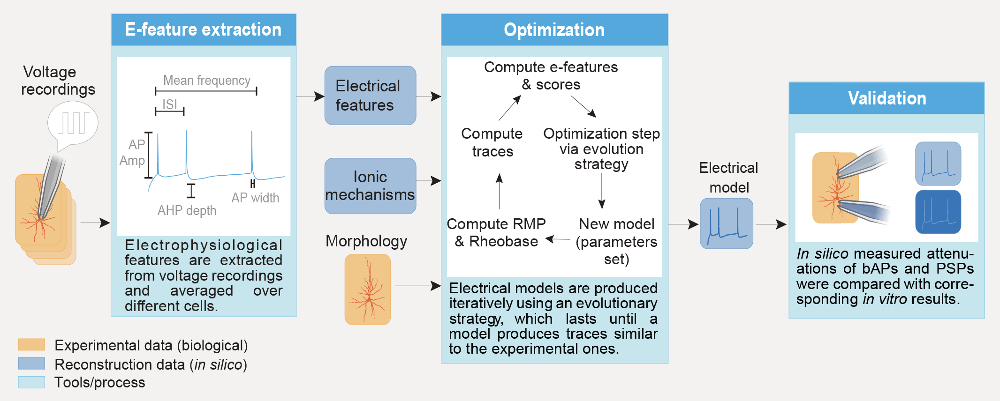
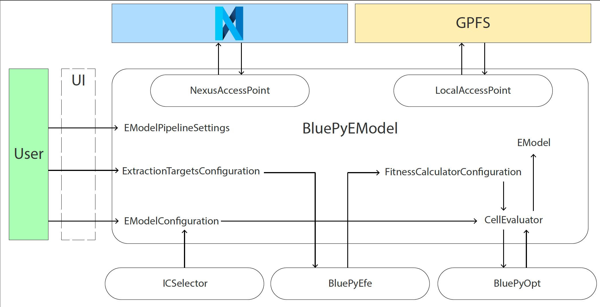

BluePyEModel: Blue Brain Python E-Model Building Library
========================================================

+----------------+------------+
| Latest Release | |pypi|     |
+----------------+------------+
| Documentation  | |docs|     |
+----------------+------------+
| License        | |license|  |
+----------------+------------+
| Build Status 	 | |tests|    |
+----------------+------------+
| Coverage       | |coverage| |
+----------------+------------+
| Citation       | |zenodo|   |
+----------------+------------+

Introduction
------------

The Blue Brain Python E-Model Building Library (BluePyEModel) is a Python package facilitating the configuration and execution of electrical neuron model (e-model) building tasks. It covers tasks such as extraction of electrical features from electrophysiology data, e-model parameters optimisation and model validation. As such, it builds on top of `eFEL <https://github.com/BlueBrain/eFEL>`_, `BluePyEfe <https://github.com/BlueBrain/BluePyEfe>`_ and `BluePyOpt <https://github.com/BlueBrain/BluePyOpt>`_.

For a general overview and example of electrical model building, please refer to the preprint: `A universal workflow for creation, validation and generalization of detailed neuronal models <https://www.biorxiv.org/content/10.1101/2022.12.13.520234v1.full.pdf>`_.

Note that this package only covers e-model building based on patch-clamp data and that it relies solely on the `NEURON <https://www.neuron.yale.edu/neuron/>`_ simulator.

Citation
--------

When you use the BluePyEModel software or method for your research, we ask you to cite the following publication (this includes poster presentations):

.. code-block::

    @software{bluepyemodel_zenodo,
      author       = {Damart, Tanguy and Jaquier, Aurélien and Arnaudon, Alexis and Van Geit, Werner},
      title        = {BluePyEModel},
      month        = aug,
      year         = 2023,
      publisher    = {Zenodo},
      doi          = {},
      url          = {}
    }

Installation
------------

To use BluePyEModel you will first need to install NEURON with Python support on your machine.

And then bluepyemodel itself

.. code-block:: python

    pip install -i https://bbpteam.epfl.ch/repository/devpi/simple/ bluepyemodel[all]

If you do not wish to install all dependencies, specific dependencies can be selected by indicating which ones to install between brackets in place of 'all' (If you want multiple dependencies, they have to be separated by commas). The available dependencies are:

- luigi
- all
- currentscape

To get started with the E-Model building pipeline
-------------------------------------------------

This section will talk about the E-Model building pipeline which for now contains e-features extraction, optimisation and model analysis. If you only wish to export a model that was built using the pipeline to hoc, you can jump to the subsection "Exporting the models".

Note that despite the present explanation, building an e-model is not a trivial process, therefore, do not hesitate to contact the Cells team for help to get you set up.

The E-Model building pipeline can be executed either step by step using Python or all at once as a Luigi workflow.

Running using python with local storage
~~~~~~~~~~~~~~~~~~~~~~~~~~~~~~~~~~~~~~~

This section presents a general picture of how to create an e-model using python and local storage, it relies on the use of the class EModel_pipeline.

For a detailed picture, please refer to the example directory `./examples/emodel_pipeline_local_python <./examples/emodel_pipeline_local_python>`_ and its `README <./examples/emodel_pipeline_local_python/README.md>`_ which shows how to setup an optimisation directory and how to run it on BB5 using slurm.

The pipeline is divided in 6 steps:
- extraction: extracts e-features from ephys recordings and averages the results e-feature values along the requested targets.
- optimisation: builds a NEURON cell model and optimises its parameters using as targets the efeatures computed during e-feature extraction.
- storage of the model: reads the results of the extraction and stores the models (best set of parameters) in a local json file.
- validation: reads the models and runs the optimisation protocols and/or validation protocols on them. The e-feature scores obtained on these protocols are then passed to a validation function that decides if the model is good enough.
- plotting: reads the models and runs the optimisation protocols and/or validation protocols on them. Then, plots the resulting traces along the e-feature scores and parameter distributions.
- exporting: read the parameter of the best models and export them in files that can be used either in NEURON or for circuit building.

These six steps are to be run in order as for example validation cannot be run if no models have been stored. Steps "validation", "plotting" and "exporting" are optional. Step "extraction" can also be optional in the case where the file containing the protocols and optimisation targets is created by hand or if it is obtained from an older project.

Configuration
#############

The main configuration file is referred to as "recipes" since it contains the recipe of how models should be built.
Therefore, in an empty directory, usually named `config`, you will need to create a file `recipes.json`. Here is an example of a recipe for a fictitious L5PC model:
.. code-block:: python
    {
        "L5PC": {
            "morph_path": "morphologies/",
            "morphology": [["L5TPC","L5TPC.asc"]],
            "params": "./params_pyr.json",
            "features": "./features_L5PC.json",
            "pipeline_settings": {
                "path_extract_config": "config/extraction_config.json",
                "optimisation_timeout": 300,
                "optimiser": "MO-CMA",
                "optimisation_params": {
                    "offspring_size": 20
                }
            }
        }
    }

Let's go over the content of this file:
- The keys of the dictionary are the names of the models that will be built. Here, we only have one model named "L5PC". This name is important as it will be used in every following step to specify which model is to be acted upon.
- `morph_path` contains the path of the directory containing the morphologies. This directory has to be a subdirectory of the directory from which the pipeline will be run. Otherwise, the morphologies cannot be versioned.
- `morphology` contains the name of the morphology file. The first element of the list is an arbitrary name for the morphology and the second is the name of the file containing the morphology. The file containing the morphology has to be in the directory specified by `morph_path`.
- `params` and `features` contains the path to the file containing the configuration of the parameters of the model and optimisation targets of the model respectively. As for the morphology, this file has to be in a local subdirectory. By convention, these files are put in the directory `./config/` or in a subdirectory of it.  To see the specific format of these configuration files, please refer to the example `./examples/emodel_pipeline_local_python <./examples/emodel_pipeline_local_python>`_. If the step "extraction" is done through the pipeline, the file containing the optimisation targets will be created programmatically by the pipeline.
- `pipeline_settings` contains settings used to configure the pipeline. There are many settings, that can each be important for the success of the model building procedure. The complete list of the settings available can be seen in the API documentation of the class `EModelPipelineSettings`. An important settings if you wish to run e-feature extraction through the pipeline is `path_extract_config` which points to the path of the json file containing the targets of the extraction process. Once again, for the format of this file, please refer to the example `./examples/emodel_pipeline_local_python <./examples/emodel_pipeline_local_python>`_.

Building the models
###################

To run the modeling pipeline, you will need to create a python script used to instantiate the pipeline and execute its different steps. The pipeline is a python object of the class `EModel_pipeline <./bluepyemodel/emodel_pipeline/emodel_pipeline.py>`_. Here is a minimal example of how to instantiate it:

.. code-block:: python
    from bluepyemodel.emodel_pipeline.emodel_pipeline import EModel_pipeline

    emodel = "L5PC"
    recipes_path = "./recipes.json"
    data_access_point = "local"

    pipeline = EModel_pipeline(
        emodel=emodel,
        data_access_point=data_access_point,
        recipes_path=recipes_path,
    )

Finally, the different steps of the pipeline can be run with the commands:

.. code-block:: python
    pipeline.extract_efeatures()
    pipeline.optimise(seed=1)
    pipeline.store_optimisation_results()
    pipeline.plot(only_validated=False)

This snippet will likely not be used as such as the different steps of the pipeline are computationally intensive and will be run separately.

Note that for the pipeline to work, the NEURON mechanisms used by the models need to be present in a local directory named "mechanisms" and compiled using the command:

.. code-block:: python
    nrnivmodl mechanisms

The final models generated using the local access point are stored in the file `final.json` and the traces of the models can be seen in `./figures/`.

Exporting the models
####################

If you wish to use the models generated with BluePyEModel outside of Python, you will need to export them as hoc files.
Following the example above, it can be done with the command:

.. code-block:: python
    from bluepyemodel.export_emodel.export_emodel import export_emodels_hoc
    access_point = pipeline.access_point
    export_emodels_hoc(access_point, only_validated=False, map_function=map)

This will create a local directory containing the hoc files of the models.

Note that if you wish to use the models in a circuit, you will have to use `export_emodels_sonata <bluepyemodel/export_emodel/export_emodel.py#L130>`_ instead.
However, most of the time, for circuit building, you will want to generalize the models to the morphologies of the circuit. For that, you will need to perform model management (MM), which is out of the scope of the present package (see `https://github.com/BlueBrain/BluePyMM <https://github.com/BlueBrain/BluePyMM>`_)

Summary of the local directory structure
########################################

The final structure of the local directory for this simpler case should be as follows:

.. code-block::
    .
    ├── pipeline.py
    ├── mechanisms
    │   ├── mode_file1.mod
    │   ├── mode_file1.mod
    │   ├── mode_file3.mod
    ├── config
    │    ├── features_L5PC.json
    │    ├── params_pyr.json
    │    ├── extraction_config.json
    │    └── recipes.json
    ├── morphologies
    │    └── L5TPC.asc

In the more complex case where githash versioning and slurm are used, refer to the structure of the example of `./examples/emodel_pipeline_local_python <./examples/emodel_pipeline_local_python>`_.

Schematics of BluePyEModel classes
~~~~~~~~~~~~~~~~~~~~~~~~~~~~~~~~~~

Acknowledgment
~~~~~~~~~~~~~~

This work has been partially funded by the European Union Seventh Framework Program (FP7/2007­2013) under grant agreement no. 604102 (HBP), and by the European Union’s Horizon 2020 Framework Programme for Research and Innovation under the Specific Grant Agreements No. 720270 (Human Brain Project SGA1) and No. 785907 (Human Brain Project SGA2) and by the EBRAINS research infrastructure, funded from the European Union’s Horizon 2020 Framework Programme for Research and Innovation under the Specific Grant Agreement No. 945539 (Human Brain Project SGA3).

Copyright
~~~~~~~~~

Copyright (c) 2023 Blue Brain Project/EPFL

This work is licensed under `Apache 2.0 <https://www.apache.org/licenses/LICENSE-2.0.html>`_

.. |license| image:: https://img.shields.io/badge/License-Apache%202.0-blue.svg
                :target: https://github.com/BlueBrain/BluePyEModel/blob/main/LICENSE.txt

.. |tests| image:: https://github.com/BlueBrain/BluepyEModel/actions/workflows/test.yml/badge.svg
   :target: https://github.com/BlueBrain/BluepyEModel/actions/workflows/test.yml
   :alt: CI

.. |pypi| image:: https://img.shields.io/pypi/v/bluepyemodel.svg
               :target: https://pypi.org/project/bluepyemodel/
               :alt: latest release

.. |docs| image:: https://readthedocs.org/projects/bluepyemodel/badge/?version=latest
               :target: https://bluepyemodel.readthedocs.io/
               :alt: latest documentation

.. |coverage| image:: https://codecov.io/github/BlueBrain/BluePyEModel/coverage.svg?branch=main
                   :target: https://codecov.io/gh/BlueBrain/bluepyemodel
                   :alt: coverage

.. |zenodo| image:: https://zenodo.org/badge/<TODO>.svg
                 :target: https://zenodo.org/badge/latestdoi/<TODO>

..
    The following image is also defined in the index.rst file, as the relative path is
    different, depending from where it is sourced.
    The following location is used for the github README
    The index.rst location is used for the docs README; index.rst also defined an end-marker,
    to skip content after the marker 'substitutions'.

.. substitutions
.. |banner| image:: docs/source/logo/BluePyEModelBanner.jpg