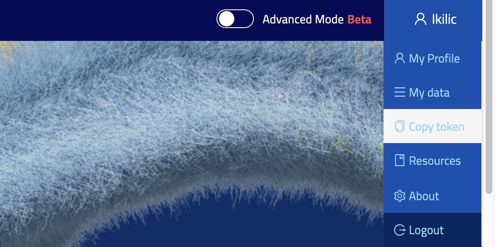

# E-Model Building Pipeline with Luigi, Nexus and bbp-workflow

This example demonstrates how to build an e-model using the Nexus access, [Luigi](https://luigi.readthedocs.io/en/stable/) and [bbp-workflow](https://github.com/BlueBrain/bbp-workflow), which automates batch job pipelines. The [NexusAccessPoint](./../../bluepyemodel/access_point/nexus.py) class serves as the API that enables users to store, manage, and use e-model resources on Nexus. This class provides a set of functions to create e-model-related resources on Nexus and link them to the electrophysiological data, mechanisms, and morphology registered on Nexus.

## 1. Setup the virtual environment
To setup the virtual environment and install all the needed packages, run:

```
kinit
./create_venv.sh
```

Note: Ensure that your Python version is 3.10 or higher, as bbp-workflow is only compatible with Python >= 3.10.

Then activate the virtual environment:

```
source myvenv/bin/activate
```

## 2. Configure the Luigi pipeline:
The ``luigi.cfg`` file contains the configuration for the Luigi pipeline. Ensure you set ``virtual-env`` to the path of your virtual environment (created in the previous step) and ``chdir`` the absolute path of the current working directory. Other parameters can be adjusted based on your requirements. Below is a description of several variables you may wish to customise:

- [DEFAULT] : settings section used by bbp-workflow.
    - ``account``: project name (e.g. proj72).
    - ``virtual-env``: path to your virtual environment.
    - ``chdir``: absolute path of the current working directory.
    - ``workers``: number of workers to be used by the pipeline. Currently, only 1 worker is supported.
    - ``time``: maximum time allowed for the pipeline to run.
- [Optimise] : settings section used for the optimisation.
    - ``node``: number of nodes to be used on the HPC.
    - ``time``: maximum time allowed to run the optimisation.
- [parallel]
    - ``backend``: select the backend for processing, which can be either 'ipyparallel' or 'multiprocessing'. If left unspecified, no parallelisation will be used.
- [EmodelAPIConfig]
    - ``nexus_project``: a valid Nexus project name to which the emodel should be uploaded.

For a detailed description of the configuration file, please refer to the [Luigi documentation](https://luigi.readthedocs.io/en/stable/configuration.html).

## 3. Register the resources that will be used by the pipeline on the Nexus project

Prior to executing the Luigi pipeline, it is essential to register the following resources within the Nexus project, as they will be needed by the pipeline:

- ``EModelPipelineSettings`` (EMPS): the pipeline settings of the e-model.
- ``ExtractionTargetsConfiguration`` (ETC): The extraction target configuration of the e-model and the links to the ephys data. This resource is created by parsing the ``targets.py`` using the  ``configure_targets`` function in ``pipeline.py``.
- ``EModelConfiguration`` (EMC): the configuration of the e-model, which links to the morphology and mechanisms and stores a reformatted version of the parameters file of the e-model.


To create and register the ``EModelPipelineSettings`` (EMPS) and ``ExtractionTargetsConfiguration`` (ETC), run:

```
python pipeline.py --step=configure_nexus --emodel=EMODEL_NAME --iteration_tag=ITERATION_TAG --etype=ETYPE --mtype=MTYPE --ttype=TTYPE
```

The ``EMODEL_NAME`` can be any string without special characters, except for underscores, e.g., "L5_TPC_B_cAC".

The ``ETYPE``, ``MTYPE`` and ``TTYPE`` have to be valid names present in the gene map (e.g., ETYPE=="cAC", MTYPE="L3_TPC:C", TTYPE="0103 L2/3 IT CTX Glut_1").

The iteration_tag can be any string without spaces. This variable enables the user to run different tests or iterations in parallel on the same e-model. All Nexus resources related to BluePyEModel will be tagged with the iteration_tag, and the pipeline will only use resources with a matching tag. It is important to ensure that the ``iteration_tag`` specified in luigi.cfg matches the ``iteration_tag`` used when running pipeline.py. If a different ``iteration_tag`` is used in pipeline.py, the pipeline will crash because BluePyEModel will not find the expected resources.

Additionally, please note that the ephys trace files and the targets (e-features and protocols) used in this example are hardcoded in the targets.py file.

The user will be prompted to confirm their intent to deprecate the resources currently present on Nexus that have the same iteration_tag and emodel name. Following this, they will be required to enter their Nexus token, which can be obtained from  https://bbp.epfl.ch/nexus/web/.


To set up the EModelConfiguration (EMC), which includes the model's channels, parameters and parameter distributions. You can either create the configuration based on gene data, or through a legacy json file. You can specify the legacy JSON file by adjusting the path of ``legacy_conf_json_file`` in ``pipeline.py`` and then run:

```
python pipeline.py --step=configure_model_from_json --emodel=EMODEL_NAME --iteration_tag=ITERATION_TAG --etype=ETYPE --mtype=MTYPE --ttype=TTYPE
```

If you choose to create the configuration based on gene data, you will need to provide a ttype, thus, ensure that you have also specified the ``TTYPE`` when running the ``configure_nexus`` step:

```
python pipeline.py --step=configure_model_from_gene --emodel=EMODEL_NAME --iteration_tag=ITERATION_TAG --etype=ETYPE --mtype=MTYPE --ttype=TTYPE
```

If you wish to modify the gene-based configuration before proceeding with model optimisation, you can get the configuration from Nexus and modify it before proceeding further. The jupyter notebook [edit_neuron_model_configuration.ipynb](../ncmv3//edit_neuron_model_configuration.ipynb) explains how to do so.

An example of how to run the `configure_nexus` and `configure_model_from_gene` steps is provided in the [run_pipeline.ipynb](./run_pipeline.ipynb) notebook.

## 4. Run the Luigi pipeline:
Set the variables ``emodel``, ``etype``, ``iteration``, ``mtype``, and ``ttype`` in ``launch_luigi.sh`` to match the values you chose for ``EMODEL_NAME``, ``ETYPE``, ``ITERATION_TAG``, ``MTYPE``, and ``TTYPE``. Additionally, ensure that the ``species`` and ``brain_region`` variables are consistent with the values in ``pipeline.py``.


Then, execute:

```
source myvenv/bin/activate
kinit
./launch_luigi.sh
```

The pipeline should start, and after a few minutes, you will see the message: "No more log messages received, connection timed out." To monitor the progress of the pipeline, you can use a web app by first executing the following command:

```
bbp-workflow webui -o
```

Then, open the URL returned by this command in your browser.

If an error happens during the execution of the workflow, the command ``./launch_luigi.sh`` can be run again and the workflow will restart from the latest step. If the error persists, please refer to the [Troubleshooting](#troubleshooting) section or contact the package's authors for further assistance.

## 5. Results:

Once the Luigi pipeline has run successfully, the following resources will be saved in the Nexus project specified by the ``nexus_project`` variable in pipeline.py, along with the hoc file of the e-model:

- ``FitnessCalculatorConfiguration`` (FCC): the fitness calculator configuration of the e-model, which stores the features and protocols file of the e-model.
- ``EmodelScript`` (ES): the hoc file of the e-model.
- ``EModelWorkflow`` (EMW): the resource to which all the above resources are linked to, including the workflow state.
- ``EModel`` (EM): all the information related to an optimised e-model. It contains the final parameters of the e-model from final.json, and pdfs of the e-model distribution plots, features scores and e-model response traces. It also links to EModelWorflow.

In conclusion, here is the graph structure that will be generated on Nexus upon completing the entire pipeline:

```
    EModelWorkflow
        |
        ├──> EModelPipelineSettings
        |
        ├──> ExtractionTargetsConfiguration
        |       |
        |       ├──> Trace1
        |       ├──> ...
        |       └──> TraceN
        |
        ├──> EModelConfiguration
        |       |
        |       ├──> Mechanism1
        |       ├──> ...
        |       └──> MechanismN
        |       └──> Morphology
        |
        ├──> FitnessCalculatorConfiguration
        |
        ├──> EModel
        |
        └──> EModelScript
```

You can also check the graph structure of the resources created on [Nexus](https://bbp.epfl.ch/nexus/web/).

To check that the models were optimised successfully, you can refer to the figures created in ``./figures/EMODEL_NAME/``.
The `optimisation` subfolder contains plots of the fitness versus number of generations run by the optimiser, while the `traces` and `scores` subfolders contain the voltage traces and efeatures scores for the e-models.

In addition, we provide a set of notebooks to help users understand how to edit some of the resources created by the pipeline. The first, [edit_fitness_calculator_configuration.ipynb](./edit_fitness_calculator_configuration.ipynb) explains how to edit an existing neuron model configuration on Nexus in order to add a new e-feature or protocol. The second notebook, [edit_neuron_model_configuration.ipynb](./edit_neuron_model_configuration.ipynb), explains how to load an already existing neuron model configuration from Nexus, edit it, and store it back on Nexus. A third notebook [exploit_model.ipynb](./exploit_model.ipynb) explains how to run other protocols on a model or investigate the final model yourself.


## Troubleshooting
Refer to the [Troubleshooting of BluePyEModel](https://github.com/BlueBrain/BluePyEModel/tree/main/examples/L5PC#troubleshooting) for common issues.


### When running launch_luigi.sh, if you see the error:

```
  RAN: /usr/bin/ssh -o StrictHostKeyChecking=no -o ExitOnForwardFailure=yes -o StreamLocalBindUnlink=yes -NT -R/tmp/2609079-sch.sock:localhost:8082 -R/tmp/2609079-agt.sock:/tmp/ssh-IlIhsVxNsOVr/agent.17 r4i3n27

  STDOUT:

  STDERR:
```

Solution: run the command "kinit" and provide your password.

### There is a failed task in the Luigi webapp:

Click on the red little "bug" button next to the task, it will display the log.

If the last line of the log reads something like: "failed to find resource for filter {...}", there are two possible causes:
1. You launched the pipeline with an iteration_tag different from the one you specified when configuring the pipeline. If that's the case, edit your luigi.cfg and inform the correct iteration_tag.
2. It happens from time to time that nexus forge fails to get a result even when a matching resource exists. If that's the case, launch the pipeline again, it will restart from where it stopped.